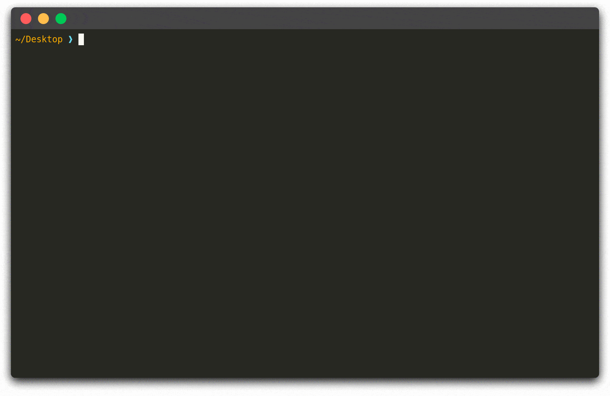

# PlaystoreDownloader

> Download Android applications directly from the Google Play Store.

[](http://www.python.org/download/releases/3.5.2/)


*TODO: add a demo animated gif*




## Configuration

Before interacting with the Play Store you have to provide valid credentials and an **ANDROID ID** associated to your account. Please modify the [credentials.json](https://github.com/ClaudiuGeorgiu/PlaystoreDownloader/blob/master/credentials.json) file and insert the required information before using this tool, otherwise it won't work.

*TODO: add instructions on how to fill missing data in `credentials.json`*


## Usage

Everything was tested and works on Ubuntu 16.04, so the following instructions refer to this operating system. It should work for other systems as well, provided there is a working Python 3 installation, which is the only requirement for this project. The first thing to do is to get a local copy of this repository, so open up a terminal in the directory where you want to save the project and clone the repository:

```Shell
$ git clone https://github.com/ClaudiuGeorgiu/PlaystoreDownloader.git
$ cd PlaystoreDownloader
```

Make sure to execute the following commands in the previously created `PlaystoreDownloader` directory:

```Shell
# If not using virtualenv (https://virtualenv.pypa.io/), skip the next 2 lines
$ virtualenv -p python3 venv
$ source venv/bin/activate

# Install PlaystoreDownloader requirements
$ pip3 install -r requirements.txt
```

After configuring the Play Store credentials as described in the [configuration](#configuration), simply call the following instruction using the package name of the app you want to download:

```Shell
$ python3 download.py "com.application.example"
```

If the download is successful, the resulting `.apk` file will be saved in the `PlaystoreDownloader/Downloads` directory (you can change the name and the location of the downloaded `.apk` file by modifying the code of [download.py](https://github.com/ClaudiuGeorgiu/PlaystoreDownloader/blob/master/download.py)).


## Contributing

Questions, bug reports and pull requests are welcome on GitHub at [https://github.com/ClaudiuGeorgiu/PlaystoreDownloader](https://github.com/ClaudiuGeorgiu/PlaystoreDownloader).


## License

You are free to use this code under the [MIT License](https://github.com/ClaudiuGeorgiu/PlaystoreDownloader/blob/master/LICENSE).
